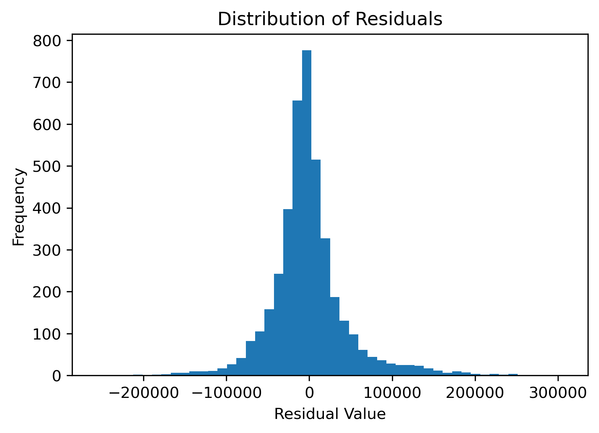
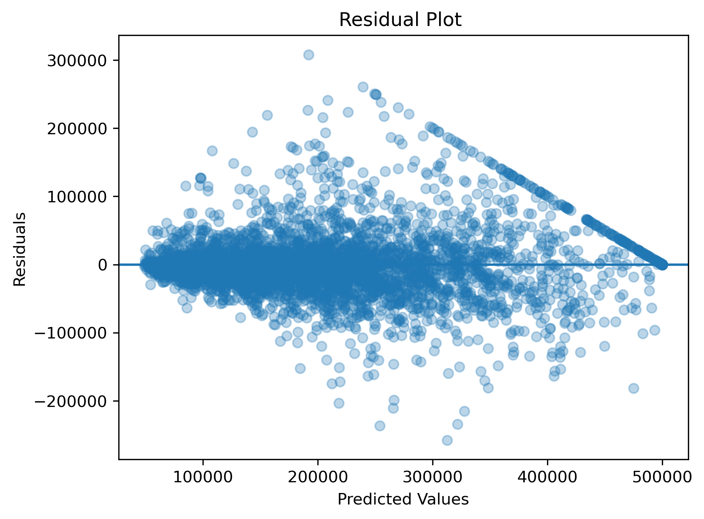

# 🏠 Housing Price Prediction (Machine Learning Project)

**Author:** Lotus Nyaupane  
**Date:** February 2026  
**Context:** Project on Housing price prediction of California.

## Project Overview
 In this project, I built a machine learning model to predict California housing prices using regression techniques. The main objective of this project was to estimate the median house value based on geographical location and housing-related features based on the data collected from 1990 U.S.Census.This project helped me understand the complete machine learning workflow and its core values to be consider, including data preprocessing, model training, evaluation, and deployment.
## Dataset Description 

The dataset contains housing information from California districts. Each row represents a district, and i set target variable to be Median_house_value as it is important factor to be consider for this project.
Some of the features includes following things . Here since other values are numerical so Ocean proximity is categorical so i seprate it into another pipeline and used the method of onehotencoder. 
Some of the main features used in the model include:

- Longitude and latitude

- Housing median age

- Total rooms and total bedrooms

- Population and households

- Median income

- Ocean proximity .

## Data Preprocessing
To prepare the data proper and more clear , I built a preprocessing pipeline using Scikit-learn and its libraries.

For numerical features:

- I handled missing values using imputation method more espicially median imputer

- I applied StandardScaler method for feature scaling.

For the categorical value (ocean_proximity):
- I used OneHotEncoder

I also performed a stratified train-test split based on income categories to make sure the training and testing data had a similar distribution.

## Model Used:
Firstly i used LinearRegeressor and Decision Tree but the  prediction was given best by Random Forest Regressor so that i had gone through Radom Forest as it work best on Structured Data.

## Model Evaluation
 To evaluate performance, I used 10-fold cross-validation with Root Mean Squared Error (RMSE).
 
 Finding and Result:

  - Cross-validation RMSE ≈ 49,000

  - Final Test RMSE ≈ 47,197

**Model performasnce Visualization**

The residual distribution is centered around zero.Most prediction errors are small, while larger deviations occur less frequently, especially for high-value houses.

The residual plot shows the difference between actual and predicted values. Most residuals are centered around zero, indicating that the model does not show strong systematic bias.

## Conclusion:
 Through this project, I gained practical experience in building structured machine learning pipeline on both of the numerical and categorical values  and evaluating regression models properly. It strengthened my understanding of data preprocessing, preventing data leakage, and interpreting model performance realistically and evenlly more in my Data_Science Journey.Overall, through  this project it helped meto  apply theoretical machine learning concepts to a real-world regression problem and find the solution of the project.